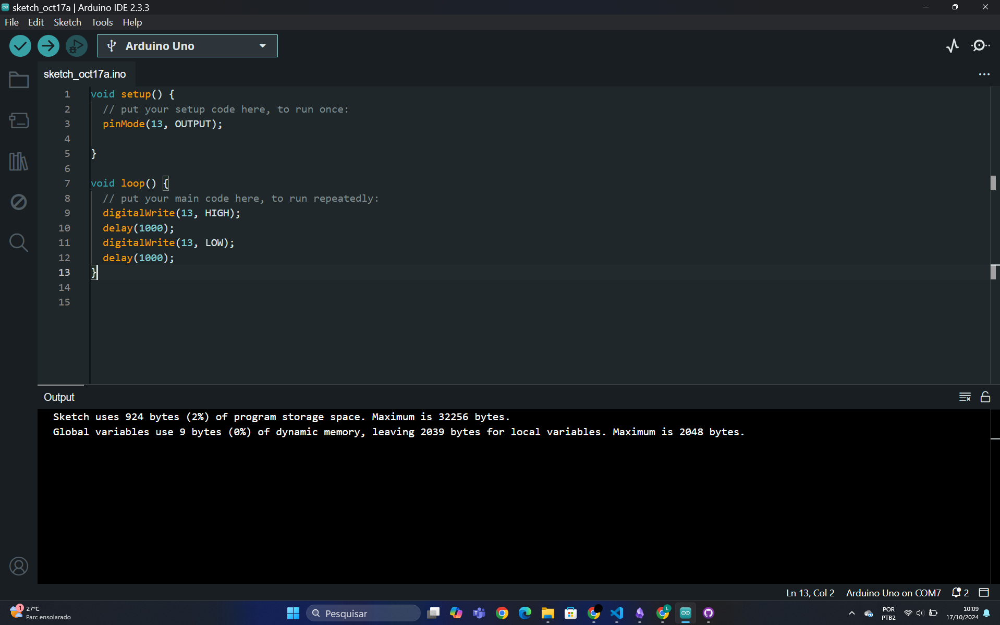
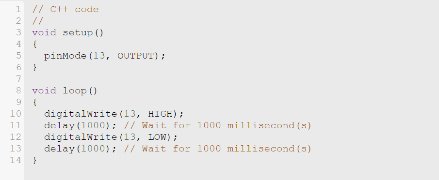

# PONDERADA DE PROGRAMAÇÃO

## Parte 1: Simulando Blink Led Interno
O Vídeo ["simulando_blink_led_interno.mp4"](https://youtube.com/shorts/aGXXmc6yRuU?si=AgBar0mkBOFfkic3) mostra o funcionamento do arduino ligando e desligando o LED `LED_BUILTIN` com um delay de um segundo.

### Screen Shot do Código

## Parte 2: Simulando o Blink Externo
O Vídeo ["simulando_blink_led_externo.mp4"]("https://youtu.be/yaiXHl8Ks40") mostra o ciclo de ascender e apagar do Led externo, posicionado na protoboard, ocasionado por um algoritimo.

### Scren Shot do Código

### Link do Tinkercad
Link: https://www.tinkercad.com/things/klRn2J0bktM/editel?sharecode=wv9hguwcF9-CE_OqE9YQNDjPbgg4PsueOx6iJxh-JIM

## Algoritimo utilizado em ambas as partes da ponderada

'''

void setup()
{
  pinMode(13, OUTPUT);
}

void loop()
{
  digitalWrite(13, HIGH);
  delay(1000); // Wait for 1000 millisecond(s)
  digitalWrite(13, LOW);
  delay(1000); // Wait for 1000 millisecond(s)
}

'''