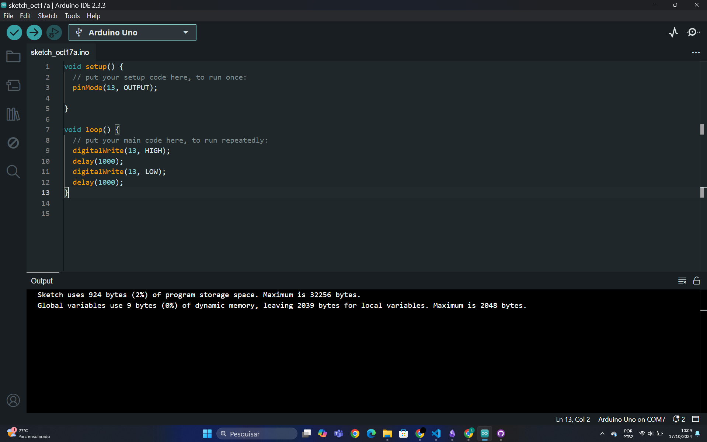

# PONDERADA DE PROGRAMAÇÃO

## Parte 1: Blink Led Interno
O Vídeo "arduino.mp4" mostra o funcionamento do arduino ligando e desligando o led "LED_BUILTIN" com um delay de um segundo.

**Screen Shot do **

Código:

'''
void setup() {
  // put your setup code here, to run once:
  pinMode(13, OUTPUT);

}

void loop() {
  // put your main code here, to run repeatedly:
  digitalWrite(13, HIGH);
  delay(1000);
  digitalWrite(13, LOW);
  delay(1000);
}

'''

